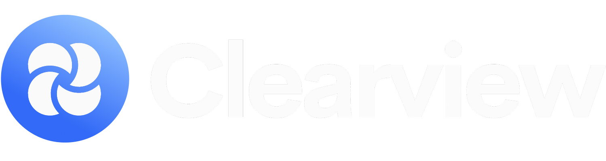

<p align="center">
  
</p>

# Clearview - News and Article Bias Analyzer

## Available Now

<div align="left">
    <br>
  <a href="https://chromewebstore.google.com/detail/clearview-ai-powered-poli/eaaojgnnhjbcmggeepkpkemopfnjcpnb?hl=en&authuser=0">
    
  </a>
    <br><br>
</div>


Clearview is a Chrome extension that empowers readers to understand the political bias in news articles through advanced language analysis. By providing objective metrics and highlighting potentially biased content, Clearview helps users make more informed decisions about their news consumption.

## Purpose

In today's polarized media landscape, it's increasingly difficult to identify bias in news reporting. Clearview addresses this challenge by:
- Providing objective analysis of political bias in news articles
- Highlighting specific instances of politically charged language
- Helping readers develop a more critical approach to news consumption
- Promoting media literacy and balanced news reading habits

## Target Audience

Clearview is designed for:
- News readers seeking objective analysis of media bias
- Students and educators studying media literacy
- Researchers analyzing political discourse
- Anyone interested in understanding different political perspectives
- Journalists and content creators aiming to maintain balanced reporting

## Features

- **Instant Bias Analysis**: Get immediate feedback on an article's political bias on a scale from -100 (very liberal) to +100 (very conservative)
- **Confidence Scoring**: See how confident the analyzer is in its bias assessment
- **Flagged Sections**: View specific quotes from the article that contain politically charged language
- **Dark Mode Support**: Toggle between light and dark themes for comfortable reading
- **Interactive UI**: Click on flagged sections to jump directly to them in the article
- **Easy Link Sharing**: Quick copy functionality for article URLs

## Installation

### Chrome Web Store
1. Visit the [Chrome Web Store](https://chrome.google.com/webstore/detail/clearview/YOUR_EXTENSION_ID)
2. Click "Add to Chrome"
3. Confirm the installation

### Manual Installation (For Developers)
1. Clone this repository or download the source code
2. Open Chrome and navigate to `chrome://extensions/`
3. Enable "Developer mode" in the top right
4. Click "Load unpacked" and select the extension directory

## Usage

1. Navigate to any news article
2. Click the Clearview extension icon in your browser
3. View the comprehensive bias analysis including:
    - Overall bias rating
    - Confidence score
    - Highlighted politically charged sections
4. Click on any flagged section to view it in context
5. Toggle dark/light mode using the theme icon

## Technical Details

Built using:
- JavaScript
- Chrome Extensions API
- Natural Language Processing for bias detection (Compromise, Sentiment.js)
- Custom UI components with CSS animations
- Responsive design principles

## Development

To set up the development environment:

1. Install dependencies:
```bash
npm install
```

2. Build the extension:
```bash
npm run build
```

3. Load the extension in Chrome using "Load unpacked"

## Privacy

Clearview respects user privacy:
- No personal data collection
- Analysis performed locally
- No tracking or analytics
- No third-party data sharing

## Contributing

Contributions are welcome! Please feel free to submit a Pull Request.

## Creator

Created by [Arsh Jafri](https://github.com/Arsh-Jafri)
- [LinkedIn](https://www.linkedin.com/in/arshjafri/)
- [GitHub](https://github.com/Arsh-Jafri)

## License

This project is licensed under the MIT License - see the LICENSE file for details
